# DealShaq Data Flow Diagram

This document describes the data flow and system architecture of DealShaq.

## System Overview

```mermaid
flowchart TB
    subgraph Users
        DAC["🛒 Consumer (DAC)"]
        DRLP["🏪 Retailer (DRLP)"]
        ADMIN["👤 Admin"]
    end

    subgraph Frontend["Frontend (React)"]
        CA[Consumer App]
        RA[Retailer App]
        AA[Admin App]
    end

    subgraph Backend["Backend (FastAPI)"]
        AUTH[Auth Service]
        RSHD[RSHD Service]
        NOTIF[Notification Service]
        GEO[Geographic Service]
        SCHED[Scheduler Service]
        CAT[Categorization Service]
    end

    subgraph Database["MongoDB"]
        USERS[(users)]
        DRLPLOC[(drlp_locations)]
        DACDRLP[(dacdrlp_list)]
        DRLPDAC[(drlpdac_list)]
        RSHDITEMS[(rshd_items)]
        NOTIFS[(notifications)]
        ORDERS[(orders)]
    end

    subgraph External
        GEOCODE[Geocoding API]
        LLM[OpenAI / Emergent]
    end

    DAC --> CA
    DRLP --> RA
    ADMIN --> AA

    CA --> AUTH
    CA --> NOTIF
    CA --> GEO
    RA --> AUTH
    RA --> RSHD
    AA --> AUTH

    AUTH --> USERS
    RSHD --> RSHDITEMS
    RSHD --> NOTIF
    NOTIF --> NOTIFS
    NOTIF --> DRLPDAC
    GEO --> DACDRLP
    GEO --> DRLPDAC
    GEO --> DRLPLOC
    SCHED --> USERS
    SCHED --> ORDERS
    CAT --> LLM

    CA -.-> GEOCODE
```

## Data Models

### User Document (users collection)

### Geographic Data Models

### RSHD and Notification Models

## Data Flow: RSHD Notification Matching

## Data Flow: DACSAI Update

## API Endpoints Overview

### Authentication
| Endpoint | Method | Description |
|----------|--------|-------------|
| `/api/auth/register` | POST | Register new user (DAC/DRLP) |
| `/api/auth/login` | POST | Login and get JWT token |
| `/api/auth/me` | GET | Get current user profile |
| `/api/auth/password-reset/request` | POST | Request password reset email |
| `/api/auth/password-reset/confirm` | POST | Confirm password reset |

### DAC Geographic (DACSAI / DACDRLP-List)
| Endpoint | Method | Description |
|----------|--------|-------------|
| `/api/dac/retailers` | GET | Get DAC's DACDRLP-List |
| `/api/dac/retailers/add` | POST | Add retailer to list |
| `/api/dac/retailers/{id}` | DELETE | Remove retailer from list |
| `/api/dac/dacsai` | PUT | Update DACSAI-Rad |
| `/api/dac/location` | PUT | Update delivery location |

### DAC Favorites (DACFI-List)
| Endpoint | Method | Description |
|----------|--------|-------------|
| `/api/favorites/items` | GET | Get favorite items by category |
| `/api/favorites/items` | POST | Add item to favorites |
| `/api/favorites/items/delete` | POST | Remove item from favorites |
| `/api/users/settings/auto-threshold` | PUT | Update auto-add threshold |

### DRLP Operations
| Endpoint | Method | Description |
|----------|--------|-------------|
| `/api/drlp/locations` | GET | List all DRLP locations |
| `/api/drlp/locations` | POST | Create DRLP location |
| `/api/drlp/my-location` | GET | Get current DRLP's location |

### RSHD Operations
| Endpoint | Method | Description |
|----------|--------|-------------|
| `/api/rshd/items` | GET | List RSHD items (by category) |
| `/api/rshd/items` | POST | Post new RSHD item |
| `/api/rshd/my-items` | GET | Get DRLP's own items |
| `/api/rshd/items/{id}` | PUT | Update RSHD item |
| `/api/rshd/items/{id}` | DELETE | Delete RSHD item |

### Notifications
| Endpoint | Method | Description |
|----------|--------|-------------|
| `/api/notifications` | GET | Get DAC's notifications |
| `/api/notifications/{id}/read` | PUT | Mark notification as read |

### Orders
| Endpoint | Method | Description |
|----------|--------|-------------|
| `/api/orders` | GET | Get user's orders |
| `/api/orders` | POST | Create new order |

## Key Principles

1. **Bidirectional Sync**: DACDRLP-List and DRLPDAC-List must always be in sync
2. **Manual Override Preservation**: User preferences (add/remove) are never auto-reverted
3. **Stop-after-first-hit**: Efficiency optimization in notification matching
4. **Brand/Generic Logic**: Flexible matching based on user preference specificity
5. **Geographic Anchoring**: All notifications are geographically relevant via DACSAI
