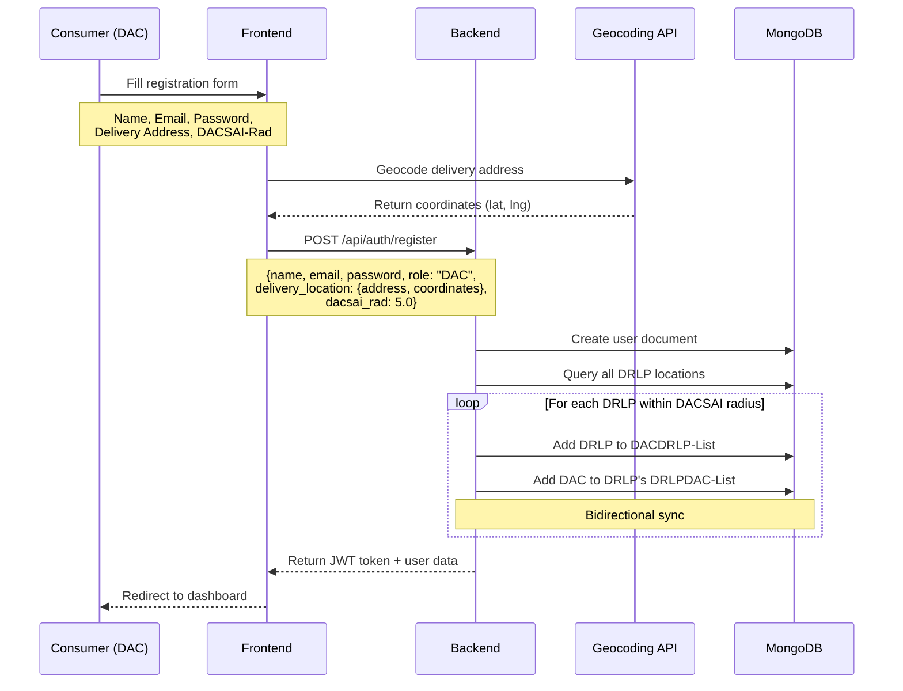
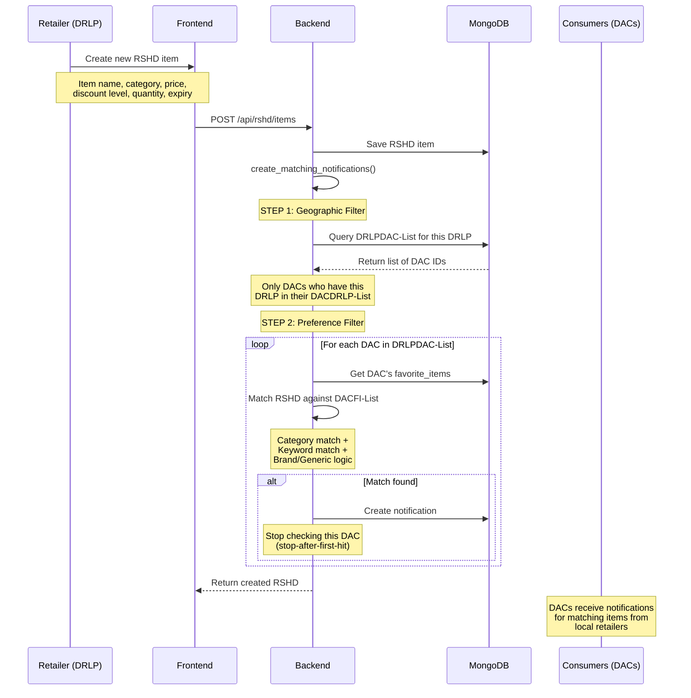
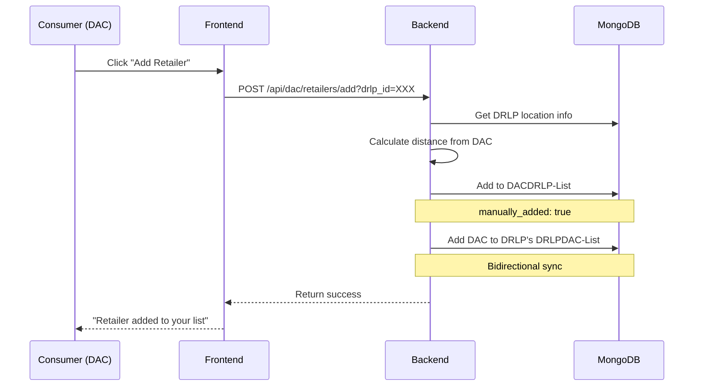
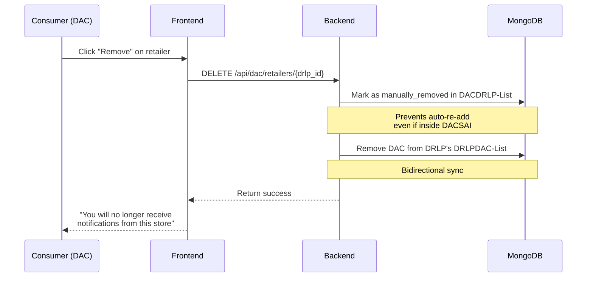
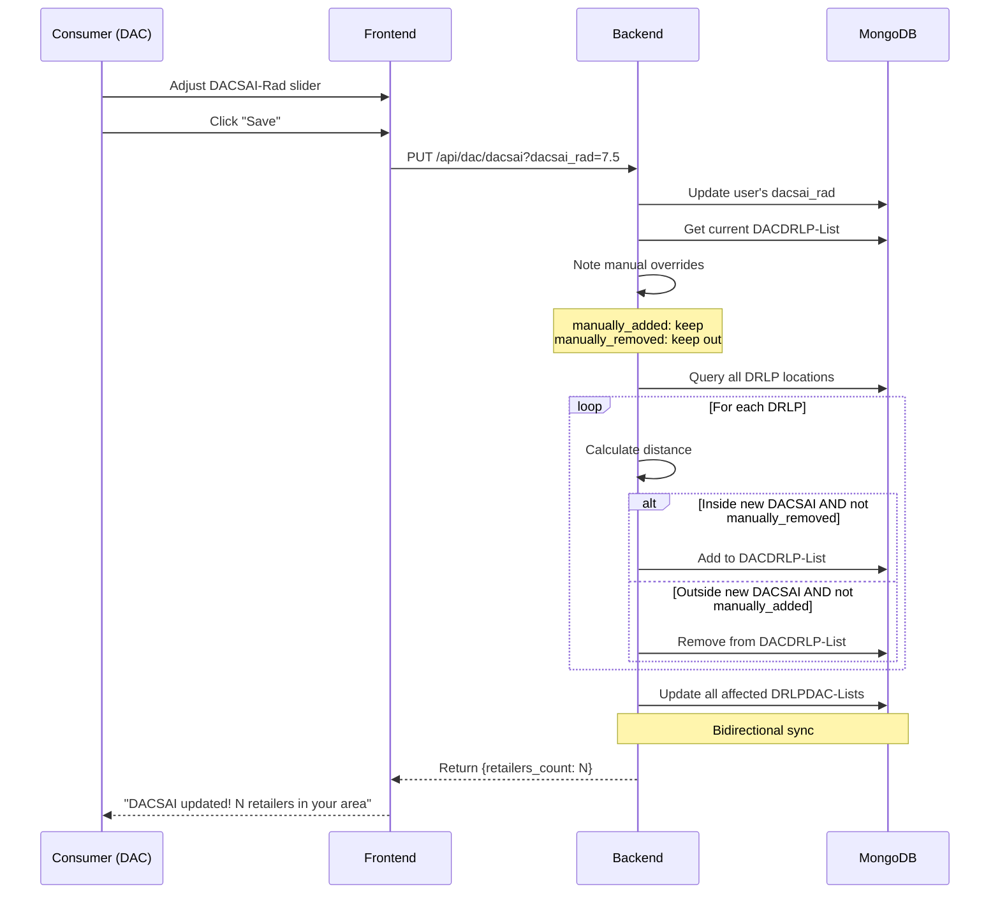
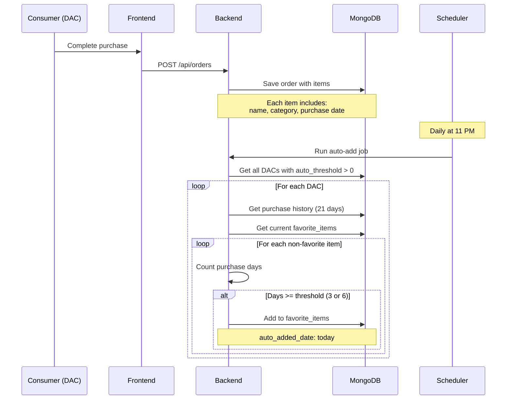

# DealShaq Transaction Sequence Diagram

This document describes the key transaction flows in the DealShaq system.

## 1. DAC Registration Flow

## 2. DRLP Posts RSHD (Deal) Flow

## 3. DAC Manages DACDRLP-List Flow

### 3a. Add Retailer (Outside DACSAI)

### 3b. Remove Retailer (Inside DACSAI)

## 4. DAC Updates DACSAI-Rad Flow

## 5. Purchase and Auto-Add Favorites Flow

## Key Concepts

### DACSAI (DAC's Shopping Area of Interest)
- Circular geographic area defined by:
  - **Center**: DAC's delivery location (coordinates)
  - **Radius**: DACSAI-Rad (0.1 to 9.9 miles)

### Bidirectional Sync
- **DACDRLP-List**: Which retailers a DAC wants notifications from
- **DRLPDAC-List**: Which DACs want notifications from a retailer
- These lists MUST be kept in sync:
  - Add to one → Add to the other
  - Remove from one → Remove from the other

### Matching Logic
1. **Geographic Filter**: Only DACs in DRLPDAC-List are considered
2. **Preference Filter**: RSHD must match DAC's DACFI-List
3. **Brand Logic**:
   - Brand-specific favorite → Must match brand AND generic
   - Generic favorite → Any brand is OK
4. **Stop-after-first-hit**: One notification per DAC per RSHD batch
